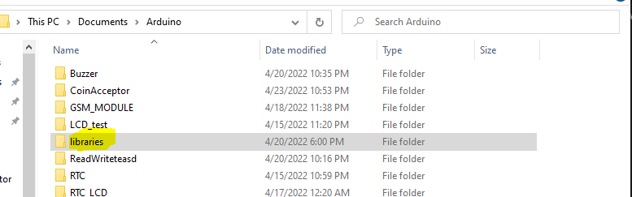
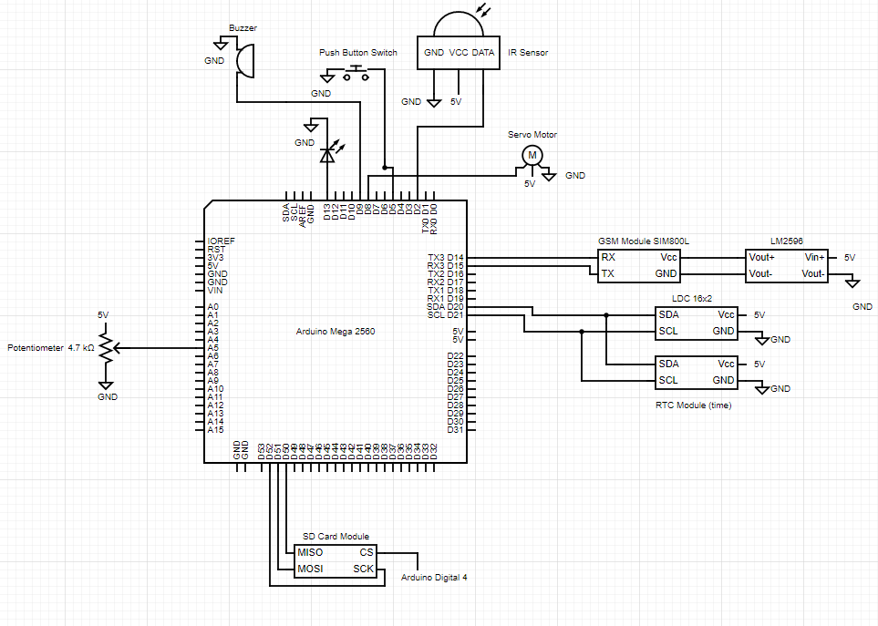

# MedBox
Dispenses medicine on the set time and date.
Sends SMS notification when it’s time to take the medicine, medicine is taken, 5min interval when medicine isn’t taken yet up to 3x. if 3rd time isn’t taken still an SMS will be sent that the patient missed a dose. Records data of the medicine such as the time taken, missed doses and how many medicine vials are loaded.

## Steps to Setup MedBox
1. Clone this repository 
```
git clone https://github.com/pd1drone/MedBox
```
2. Get the LiquidCrystal_I2C, RTClib, Time, UnixTime folders and copy it to the folder libraries it is located the arduino codes has been save it will have a libraries folder. The default folder of arduino is in /Documents/Arduino/libraries/


3. Setup the Schematic Diagram Below


4. After setting up the Schematic Diagram Open the MedBox.ino file in arduino and then upload.

5. To adjust the movement of the servo motor go to the MedBox.ino file Line 309, and change the value of 180 from 0 to 180
```
 if (DosageTime == now.unixtime()){
    SendMessage("Its time to take medicine ");
    lcd.clear();
    lcd.setCursor(0,0);
    lcd.print("Its time to");
    lcd.setCursor(0,1);
    lcd.print("take medicine");
    servo.write(180);
```
6. Adjust number of recipient in line 164
```
String number = "+639264562589"; //-> change with your number
```
7. The Files that will be save in the SD card are 
 - DOSE_LOG.txt - This will contain the dose time schedule
 - DATA_LOG.txt - This will contain the "Data - " text command you sent 
 - VIAL_LOG.txt - This will contain the number of dials
 - ALL_LOG.txt - This will contain all the logs that will be recorded
 - history.txt - This will contain the dosage history of the patient

## Format of SMS Command
### To send sms data command just add the "Data" word in from of the sms text you are going to send
```
Data - 
```

### To set the Time send this message at April 25, 2022 12:00AM
```
Set medicine 4/25/2022 0:0:0 
```

### Quantity of Vials SMS command, To Setup you need to send this sms message
```
100 Vials is loaded
```
> The format should be # of vials then "Vials is loaded"

